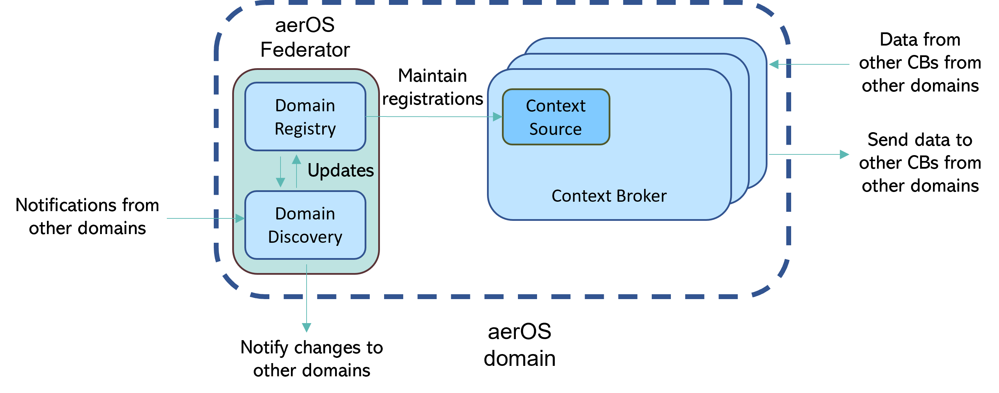
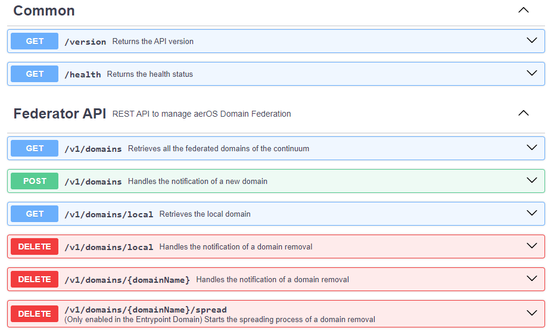

# aeriOS Federator

[](https://goreportcard.com/report/github.com/eclipse-aerios/federator)

The aeriOS Federator serves as a management service responsible for controlling the establishment and maintenance of federation mechanisms among the multiple aeriOS domains that form the Cloud-Edge-IoT continuum. This component is intended to provide an additional layer of automatization above a NGSI-LD Context Broker (e.g. Orion-LD) to avoid direct interaction with the context brokers of the continuum when it comes to federation management, as well as federated backup mechanisms for federation critical data (e.g. domains registry).

Developed using Golang 1.22 and Gingonic v1.10.0.

## Architecture



### API Endpoints
The [OpenAPI specification](docs/openapi.yaml) is included inside the *docs* folder.



## Configuration

NOTE: it is recommended to use the Federator of the entrypoint domain as the peer federator

The aeriOS Federator must be configured through the use of a set of environment variables:

- **APP_ENV**: environment mode of the application (*development* or *production*).
- **APP_PORT**: TCP port on which is exposed the application.
- **IS_ENTRYPOINT**: boolean value to set if the Federator is deployed in the entrypoint domain.
- **DOMAIN_NAME**: name of the domain in which is deployed the Federator.
- **DOMAIN_DESCRIPTION**: description of the domain in which is deployed the Federator.
- **DOMAIN_PUBLIC_URL**: public URL of the domain in which is deployed the Federator.
- **DOMAIN_OWNER**: of the domain in which is deployed the Federator.
- **DOMAIN_CB_URL**: URL pointing to the Orion-LD (NGSI-LD Context Broker) instance of the domain. This URL must directly point to Orion-LD without passing through KrakenD or other API gateways. For instance: *http://192.168.1.202:1036* or *http://orion-ld-broker.default.svc.cluster.local:1026*
- **DOMAIN_CB_HEALTH_URL**: (only needed if the value of *CB_HEALTH_CHECK_MODE* is *socket*) URL pointing to the TCP healthcheck Orion-LD instance of the domain. This URL must directly point to Orion-LD without passing through KrakenD or other API gateways. For instance: *http://192.168.1.202:1036* or *http://orion-ld-broker.default.svc.cluster.local:1026*.
- **DOMAIN_FEDERATOR_URL**: (not compulsory) only needed if the Federator won't be exposed through the domain's KrakenD (*https://domain-public-url/federator*). This will be used by other Federators to reach this Federator.
- **PEER_FEDERATOR_URL**: URL pointing to your peer aeriOS Federator, which must be selected in advance. For instance, *https://cf-domain.github.com/eclipse-aerios/federator/federator*.
- **CB_HEALTH_CHECK_MODE**: mode of the health checks (*endpoint* or *socket*). *Endpoint* means that a HTTP request is sent to the */version* endpoint of Orion, while *socket* means that a TCP connection is opened.
- **TLS_CERTIFICATE_VALIDATION**: boolean value to skip certificate validation in requests to HTTPS endpoints.
- **CB_TOKEN_MODE**: mode of the CB authorization token retrieval. In order to retrieve this token, it can be used the aerios-k8s-shim (*shim*) or Keycloak (*keycloak*).
- **AERIOS_SHIM_URL**: (only needed if **CB_TOKEN_MODE=shim**) URL of the *aerios-k8s-shim* API.
- **CB_OAUTH_CLIENT_ID**: (only needed if **CB_TOKEN_MODE=keycloak**) CLIENT ID of the ContextBroker OAuth client in Keycloak.
- **CB_OAUTH_CLIENT_SECRET**: (only needed if **CB_TOKEN_MODE=keycloak**) CLIENT SECRET of the ContextBroker OAuth client in Keycloak.
- **KEYCLOAK_URL**: URL of the continuum's Keycloak instance.
- **KEYCLOAK_REALM**: realm of the continuum's Keycloak instance.

## Container image 
To build the container image for the same CPU architecture of the developing/building machine:

```bash
docker build -t <container-image-repository-url>/aerios-federator --build-arg COMMIT_HASH=$(git rev-parse HEAD) .
```

For being able to build multi-arch images, a compatible Docker builder must be used.

To build the multi-arch container image:

```bash
docker buildx build --provenance=false --push --platform=<target-platforms> -t <container-image-repository-url>/aerios-federator:<tag> --build-arg COMMIT_HASH=$(git rev-parse HEAD) .
```

To build the multi-arch image (for *linux/arm64,linux/amd64* in this casse) and push it directly to the Common deployments repository, without storing it locally:

```bash
docker buildx build --provenance=false --push --platform=linux/arm64,linux/amd64 -t <container-image-repository-url>/aerios-federator --build-arg COMMIT_HASH=$(git rev-parse HEAD) .
```

## Deploy the aeriOS Federator
A Helm chart and a Docker compose file are provided, so check the *configuration* section to configure them accordingly. In addition, an already running Orion-LD (or an alternative NGSI-LD CB) instance is needed.

## Testing
The federator has been tested in a local development scenario composed of 4 domains (4 federator and 4 Orion-LD instaces, one per CB-Federator instance for each domain). This scenario doesn't include Krakend, so the *DOMAIN_FEDERATOR_URL* env var has been used.

The environment files of this testing scenario are included inside the *test* folder.

## Developer guide
The value of the *APP_ENV* env var must be set to *development*, which is the default value. Then, in order to load environment variables from a valid *.env* file for development purposes, configure the proper values of *folder* and *file name* (without the .env extension) using the constant variables defined in lines 63 and 64 of [config/config.go](config/config.go) file. The code uses by default the *.env* file to retrieve the environment variables. Furthermore, some examples are included inside the *test* folder.

The requirements for setting a proper environment for running the application are:

1. An already running Orion-LD (or an alternative NGSI-LD CB) instance directly reachable by the federator (configured through the *DOMAIN_CB_URL* env var).
2. At least, another aeriOS Federator running (along with its own Orion-LD instance). One federator must be configured as the entrypoint one (*IS_ENTRYPOINT* env var).
3. If the testing Orion-LD instances aren't behind a KrakenD, don't include the `/orionld` path in the CSRs if you want to achieve a valid federation. To do it, check lines 68, 115, 149  and 189 of *models/contextSourceRegistration.go*.

Finally, run this command to start the application:

```bash
go run main.go
```

### Build the application
The aeriOS Federator has been developed using Golang, so it can be packaged as a binary executable, which is ready to be run in the same OS in which the *go build* command has been executed:

```bash
go build -ldflags "-X github.com/eclipse-aerios/federator/controllers.buildTime=$(date -u +%Y-%m-%dT%H:%M:%SZ) -X github.com/eclipse-aerios/federator/controllers.commitHash=$(git rev-parse HEAD)"
```

Golang has the advantage that applications can be easily packaged for different OS and CPU architecrtues (the complete list can be obtained by running `go tool dist list`), so in Linux you can run this command to compile the federator for different platforms:

```bash
env GOOS=<target-OS> GOARCH=<target-architecture> go build -ldflags "-X github.com/eclipse-aerios/federator/controllers.buildTime=$(date -u +%Y-%m-%dT%H:%M:%SZ) -X github.com/eclipse-aerios/federator/controllers.commitHash=$(git rev-parse HEAD)"
```

For instance, in case of Linux running on a ARM64 machine:

```bash
env GOOS=linux GOARCH=arm64 go build -ldflags "-X github.com/eclipse-aerios/federator/controllers.buildTime=$(date -u +%Y-%m-%dT%H:%M:%SZ) -X github.com/eclipse-aerios/federator/controllers.commitHash=$(git rev-parse HEAD)"
```